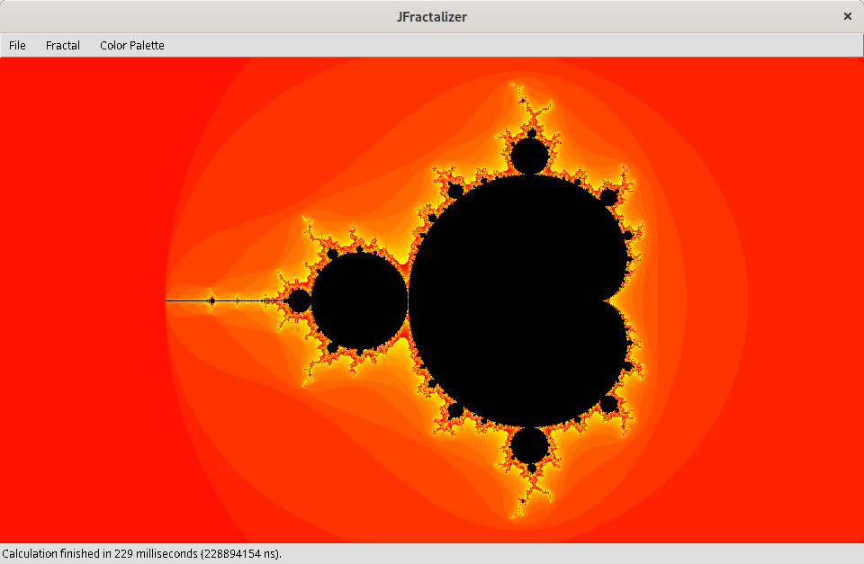
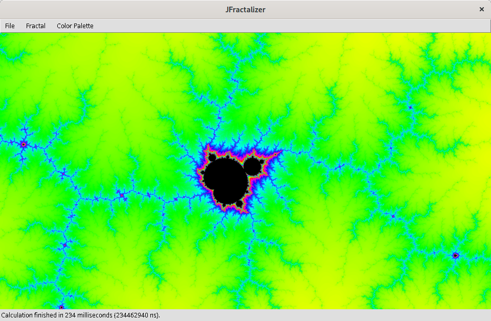
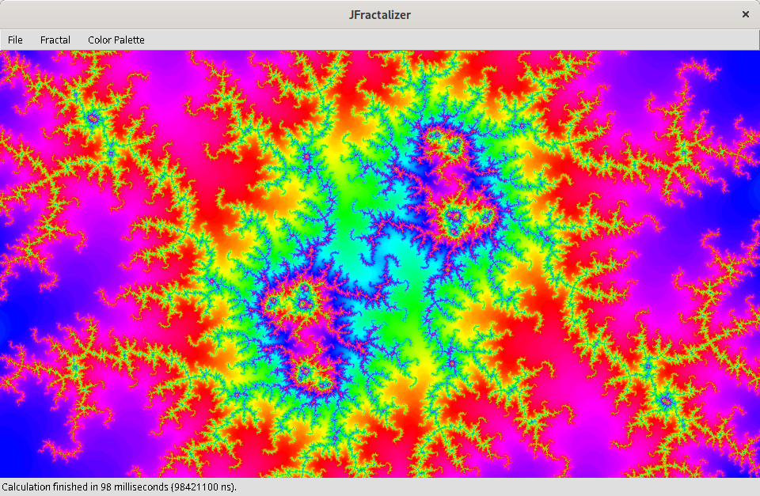

JFractalizer
============

The **JFractalizer** is a fractal explorer, written in Java.
The inspiration, and the idea for the name, comes from the freeware [Fractalizer](https://web.archive.org/web/20120712012506/http://www.fractalizer.de/en).
JFractalizer includes many of its features, often performs better, and is published under the GNU GPLv3.

JFractalizer is not under active development.
It was mostly created in 2012 and 2013, as a free-time training and for-fun project;
since then, I’ve occasionally come back to it,
but as of 2022 I don’t plan to spend significant effort on it.
It remains usable though, and in my opinion it can also be useful,
even compared to other freely available fractal explorers.

How to run
----------

Under Linux, you should be able to clone the repository, compile the code, and run it.

```sh
git clone https://github.com/lucaswerkmeister/JFractalizer.git
cd JFractalizer
./compile.sh
./run.sh
```

The program should also run under Windows, but I don’t know enough `.bat` syntax to provide equivalent scripts anymore.
You can try to create an equivalent of the `compile.sh` and `run.sh` scripts (they’re not too complicated),
or maybe use an IDE like Eclipse to run the program.

The command line interface can best be described as “idiosyncratic”;
the [wiki page on the Command Line Options](https://github.com/lucaswerkmeister/JFractalizer/wiki/Command-Line-Options) has some documentation and examples.

Features
--------

Explore the Mandelbrot or Julia Set and enjoy high-speed calculation (tries to utilize all processor cores, by dividing the image into parts - 2x2 on a quad-core processor) and high image quality (SuperSampling AntiAliasing).
Save and load your favourite setups, including the color palette.
Save the image you're seeing in various formats.
(You can also generate a film zooming into the fractal, but only via the command line.)

### Screenshots

Parts of the JFractalizer user interface:








Some of its results:


Plugins
-------

The JFractalizer is split into two parts:

1. The *Core* is the program that is started when running the JFractalizer. It provides the GUI and loads plugins.
2. The *Default Plugin* contains the implementation of the Mandelbrot fractal, as well as two ColorPalette implementations (ColorPalettes are used by fractals to color the images).

Everyone can write other plugins.
I never got around to writing a detailed guide on how to do this;
very briefly, you’d need to implement the `Fractal` or `ColorPalette` interfaces and prepare them for the Java ServiceLoader.
See also the Default Plugin for an example, of course.
